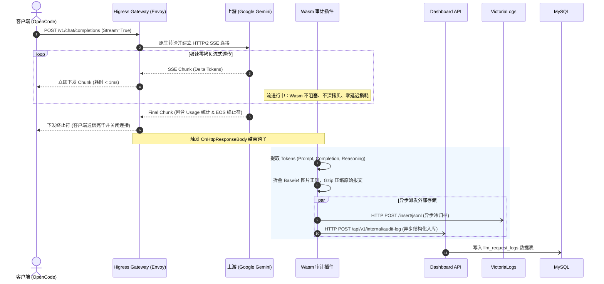

# my-higress-svc 核心技术架构设计书 (Architecture Design)

> **文档版本**：v1.0.0 · **编制时间**：2026-10-03 · **核心主笔**：Cindy (主人贴身大秘❤️)  
> **战略目标**：以 Envoy C++ 为高性能内核，构建微秒级延迟、兼具财务审计与大报文归档的高可用 AI Gateway。

---

## 1. 全局系统架构拓扑 (Overall Architecture)

```text
       ┌────────────────────────────────────────────────────────┐
       │     客户端生态 (OpenCode / Claude Code / Codex / Agents) │
       └───────────────────────────┬────────────────────────────┘
                                   │ HTTPS / HTTP/2
                                   ▼
       ┌────────────────────────────────────────────────────────┐
       │   OCI ALB (永久免费 Layer 7 负载均衡器 161.118.240.179) │
       └───────────────────────────┬────────────────────────────┘
                                   │ 灰云同网段内网穿透 (<0.2ms 延迟)
                                   ▼
┌─────────────────────────────────────────────────────────────────────────────┐
│               Higress AI Gateway (运行于 OCI free-arm-vm 4C24G)             │
│                                                                             │
│  ┌───────────────────────────────────────────────────────────────────────┐  │
│  │ 1. 协议转换与模型路由层 (ai-proxy 核心引擎)                             │  │
│  │    • POST /v1/chat/completions (OpenAI 协议 ➔ Google Gemini 原生格式)   │  │
│  │    • 熔断降级 (Fallback): gemini-3.8-flash ➔ gemini-3.8-backup (A6)    │  │
│  │    • 深度推理模型: kimi-k3 ⇄ glm-5.3 ➔ gpt-5.6-luna (A6 / 元衡通道)     │  │
│  │    • 零内存拷贝 SSE 流式透传 (Zero-Copy Transfer)                      │  │
│  └──────────────────────────────────┬────────────────────────────────────┘  │
│                                     │                                       │
│  ┌──────────────────────────────────▼────────────────────────────────────┐  │
│  │ 2. 裸流直通通道 (Direct Pass-through Route)                            │  │
│  │    • /hermes/yui ➔ 直通本地 100.115.214.26:8644 (保留 tool.progress)    │  │
│  │    • /hermes/rin ➔ 直通本地 100.115.214.26:8642                         │  │
│  └───────────────────────────────────────────────────────────────────────┘  │
│                                     │                                       │
│  ┌──────────────────────────────────▼────────────────────────────────────┐  │
│  │ 3. Wasm-Go 财务审计与冷归档插件 (finops-audit.wasm)                      │  │
│  │    • 挂载于 OnHttpResponseBody 阶段 (仅在响应流结束/EOS 时触发旁路逻辑)     │  │
│  │    • 解析 Usage: Prompt / Completion / Reasoning Tokens 准确提取       │  │
│  │    • 正则穿透折叠 Base64 图片，保护冷存储空间                             │  │
│  └─────────────────┬─────────────────────────────────┬───────────────────┘  │
└────────────────────┼─────────────────────────────────┼──────────────────────┘
                     │                                 │
     (A) 异步 HTTP POST JSONL (Gzip)    (B) 异步 HTTP POST 结构化日志
                     │                                 │
                     ▼                                 ▼
      ┌─────────────────────────────┐   ┌─────────────────────────────┐
      │ StarFive 星光板 VictoriaLogs │   │   Dashboard-API 内部写端点  │
      │   (巨型原始报文无损冷存储)   │   │  (POST /api/v1/internal/log)│
      └─────────────────────────────┘   └──────────────┬──────────────┘
                                                       │ SQLAlchemy 连接池
                                                       ▼
                                        ┌─────────────────────────────┐
                                        │     OCI MySQL HeatWave      │
                                        │     (`llm_request_logs`)    │
                                        └─────────────────────────────┘
```

---

## 2. 关键设计决策与技术选型 (Key Decisions)

| 决策点 | 选定方案 | 决策依据与架构收益 |
| :--- | :--- | :--- |
| **Reasoning Tokens 计量** | **在 MySQL 表中新增 `reasoning_tokens` 独立字段** | Gemini 3.8 等推理模型具备独立 `thoughts_token_count`。独立建列既保全了旧有统计逻辑，又能精准核算深度思考的财务消耗。 |
| **MySQL 落库中转** | **复用 `dashboard-api` 提供内部接收端点** | Wasm-Go 沙箱受限于底层 Envoy ABI，**只支持 HTTP 客户端调用**，无法直接驱动 MySQL 二进制 TCP 协议。复用已有的 Python/FastAPI 模块，无需额外维护常驻 Sink 微服务，最大化节约 4C24G 实例内存。 |
| **Wasm 编译工具链** | **标准 Go 1.24+ 配合 `GOOS=wasip1 GOARCH=wasm`** | 放弃 TinyGo，消除其 GC、反射受限及序列化第三方库报错的隐患；使用官方成熟的 Higress wasm-go SDK 构建跨平台标准字节码。 |
| **缓存层策略** | **暂时移除 Redis 响应缓存** | Agent 场景下的巨型 Prompt 几乎无命中率，且历史发生过 2.0GB 报文快照反噬 OOM 的惨痛教训。网关专注于“极致吞吐与轻量”，去除多余状态依赖。 |
| **多模型收敛** | **全系淘汰 3.7，主力与保底全部收敛为 Gemini 3.8** | 简化 Fallback 链路为一级快速降级：`gemini-3.8-flash (原生)` ➔ `gemini-3.8-backup (A6 API)`。 |

---

## 3. Wasm 审计插件运行机制与生命周期 (Wasm Hook Lifecycle)

为了绝对不拖慢网关的首字延迟 (TTFT)，`finops-audit` 插件严格遵循**异步旁路 (Non-blocking Out-of-Band)** 原则：



---

## 4. 路由状态机与故障熔断降级 (Routing & Failover)

网关由 Higress 内置的核心路由插件与策略引擎统一调度：

1. **健康检查与预检 (Pre-Call Checks)**：网关建立连接前校验后端状态；
2. **极速熔断判定**：当上游返回 `429 (Rate Limit)`、`500/502/503/504 (Server Error)` 或连接超时达 **1 次**，立即判定节点亚健康；
3. **退避重试 (Retry)**：针对瞬态网络波动支持最多 3 次指数退避重试；
4. **轻量冷却解禁 (Cooldown)**：隔离时间设为 **5 秒**，到期后允许 Canary 试探流量恢复。

---

## 5. 生产环境部署拓扑 (Production Deployment on free-arm-vm)

```text
[甲骨文云新加坡机房 VCN 10.0.0.0/16]
 │
 ├── OCI ALB (161.118.240.179:80)
 │    │
 │    └── 内网转发至 Worker Node free-arm-vm:31850 (K3s LoadBalancer NodePort)
 │
 └── 宿主机: free-arm-vm (134.185.90.98 / TS: 100.105.130.0)
      │ 4 OCPU ARM64, 24 GB 内存
      │
      └── K3s Pod 编排 (绑定 nodeSelector: kubernetes.io/hostname: free-arm-vm)
           ├── Pod: higress-gateway (C++ Envoy 内核 + Wasm 运行时)
           └── Pod: my-higress-dashboard (内嵌 React 18 SPA + FastAPI 后端)
```
