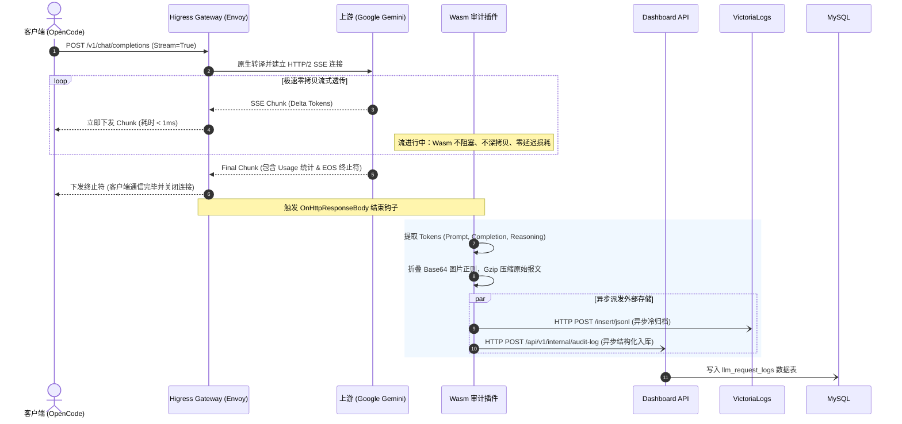

# my-higress-svc 核心技术架构设计书 (Architecture Design)

> **文档版本**：v1.0.0 · **编制时间**：2026-10-03 · **核心主笔**：Cindy (主人贴身大秘❤️)  
> **战略目标**：以 Envoy C++ 为高性能内核，构建微秒级延迟、兼具财务审计与大报文归档的高可用 AI Gateway。

---

## 1. 全局系统架构拓扑 (Overall Architecture)

```text
       ┌────────────────────────────────────────────────────────┐
       │     客户端生态 (OpenCode / Claude Code / Codex / Agents) │
       └───────────────────────────┬────────────────────────────┘
                                   │ HTTPS / HTTP/2
                                   ▼
       ┌────────────────────────────────────────────────────────┐
       │   OCI ALB (永久免费 Layer 7 负载均衡器 161.118.240.179) │
       └───────────────────────────┬────────────────────────────┘
                                   │ 灰云同网段内网穿透 (<0.2ms 延迟)
                                   ▼
┌─────────────────────────────────────────────────────────────────────────────┐
│               Higress AI Gateway (运行于 OCI free-arm-vm 4C24G)             │
│                                                                             │
│  ┌───────────────────────────────────────────────────────────────────────┐  │
│  │ 1. 协议转换与模型路由层 (ai-proxy 核心引擎)                             │  │
│  │    • POST /v1/chat/completions (OpenAI 协议 ➔ Google Gemini 原生格式)   │  │
│  │    • 熔断降级 (Fallback): gemini-3.8-flash ➔ gemini-3.8-backup (A6)    │  │
│  │    • 深度推理模型: kimi-k3 ⇄ glm-5.3 ➔ gpt-5.6-luna (A6 / 元衡通道)     │  │
│  │    • 零内存拷贝 SSE 流式透传 (Zero-Copy Transfer)                      │  │
│  └──────────────────────────────────┬────────────────────────────────────┘  │
│                                     │                                       │
│  ┌──────────────────────────────────▼────────────────────────────────────┐  │
│  │ 2. 裸流直通通道 (Direct Pass-through Route)                            │  │
│  │    • /hermes/yui ➔ 直通本地 100.115.214.26:8644 (保留 tool.progress)    │  │
│  │    • /hermes/rin ➔ 直通本地 100.115.214.26:8642                         │  │
│  └───────────────────────────────────────────────────────────────────────┘  │
│                                     │                                       │
│  ┌──────────────────────────────────▼────────────────────────────────────┐  │
│  │ 3. Wasm-Go 财务审计旁路插件 (finops-audit.wasm)                          │  │
│  │    • 挂载于 OnHttpResponseBody 阶段 (仅在流结束/EOS 时异步触发)             │  │
│  │    • 解析 Usage: Prompt / Completion / Reasoning Tokens 准确提取       │  │
│  │    • 组装审计记录与原始报文，向内部中转端点发起单次极速异步 HTTP POST       │  │
│  └──────────────────────────────────┬────────────────────────────────────┘  │
└─────────────────────────────────────┼───────────────────────────────────────┘
                                      │
                                      ▼ 异步 HTTP POST (单次派发，0 毫秒主线程阻塞)
                       ┌─────────────────────────────┐
                       │   Dashboard-API 内部写入端点 │
                       │ (POST /api/v1/internal/log) │
                       └──────────────┬──────────────┘
                                      │
       ┌──────────────────────────────┼──────────────────────────────┐
       │ (A) SQLAlchemy 连接池落库     │ (B) 3天热缓存 (Base64+Gzip)   │ (C) 永久冷归档 (Gzip JSONLine)
       ▼                              ▼                              ▼
┌─────────────────────────────┐┌─────────────────────────────┐┌─────────────────────────────┐
│     OCI MySQL HeatWave      ││       K3s 业务集群 Redis     ││ StarFive 星光板 VictoriaLogs │
│     (`llm_request_logs`)    ││(`litellm:payload:{request}`)││    (`/insert/jsonline`)     │
│  实时大屏统计与 FinOps 账本  ││   抽屉 Payload 透视 <5ms 秒开 ││   海量原始报文动态聚合检索   │
└─────────────────────────────┘└─────────────────────────────┘└─────────────────────────────┘
```

---

## 2. 关键设计决策与技术选型 (Key Decisions)

| 决策点 | 选定方案 | 决策依据与架构收益 |
| :--- | :--- | :--- |
| **Reasoning Tokens 计量** | **在 MySQL 表中新增 `reasoning_tokens` 独立字段** | Gemini 3.8 等推理模型具备独立 `thoughts_token_count`。独立建列既保全了旧有统计逻辑，又能精准核算深度思考的财务消耗。 |
| **三位一体落库中转架构** | **复用 `dashboard-api` 统筹落库 MySQL、Redis 与 VictoriaLogs** | Envoy Wasm 沙箱由于底层 ABI 限制，**只支持 HTTP 客户端调用，无法直接驱动 MySQL 二进制 TCP 协议与 Redis TCP 协议**。由 Wasm 插件单次异步 POST 原始报文与 Usage 交付 `dashboard-api`，后端复用现成的连接池同时搞定：① MySQL 审计落库；② 写入 Redis 热缓存实现抽屉 <5ms 秒开；③ 压入 VictoriaLogs 永久冷存。一次调用，三路落地，架构极简且稳定性最高！ |
| **Redis 缓存职责边界** | **保留 Payload L2 抽屉热缓存（3天），移除响应缓存** | 明确拆分两种缓存：**彻底砍掉大模型生成结果的“响应缓存”**（Agent 场景命中率几乎为 0 且容易 OOM）；**完全保留并继承“抽屉报文热缓存 (`litellm:payload:{request_id}`)”**，采用 `gzip.compress` + `base64` 存储，单条体积缩减 90%，确保大屏抽屉瞬间滑开。 |
| **Wasm 编译工具链** | **标准 Go 编写业务逻辑 (本地单测秒跑) + CI/TinyGo 产出 Wasm 字节码** | 纯算费与文本折叠逻辑零依赖下沉到 `pkg/finops`，本地通过标准 Go SDK 执行单元测试（0.005s）；云端 CI 针对 `wasi` 目标打包轻量机器二进制。 |
| **多模型收敛** | **全系淘汰 3.7，主力与保底全部收敛为 Gemini 3.8** | 简化 Fallback 链路为一级快速降级：`gemini-3.8-flash (原生)` ➔ `gemini-3.8-backup (A6 API)`。 |
| **控制面持久化与 Virtual Key 存储** | **零外部数据库依赖 (Stateless) + 基于 K8s etcd 的 Consumer CRD** | 彻底抛弃旧版 LiteLLM 对 Neon PostgreSQL 的沉重依赖。网关配置与对外分发的 Virtual Key (如分发给 Jayden 等业务端) 统一通过 Kubernetes 原生 `Consumer` CRD 声明，数据稳固持久化于 K3s 内部 etcd，由 Envoy 在 C++ 内存建立 $O(1)$ 哈希表进行微秒级鉴权，鉴权元数据直通 FinOps 审计账本。 |
| **K8s 交付与 CRD 纳管** | **方案 A：基于官方 Helm Chart 的 ArgoCD 一键全托管** | 彻底摒弃手动维护 CRD 定义的繁重负担。由 ArgoCD 声明式拉取官方 Higress Helm 仓库，自动装配 Controller、数据面 Pod 与扩展 CRD (`WasmPlugin`, `McpBridge`)，业务仓库仅维护差异化 `values.yaml` 与路由清单。 |
| **可观测大屏交付架构** | **前后端代码洁癖彻底解耦 + 统一网关同域分流 (0 CORS)** | 拒绝在 Go 后端塞入任何 HTML/静态资源胶水代码。后端 `dashboard-api` 作为纯粹的 RESTful JSON 引擎（<30MB）；前台 `frontend` 作为独立现代 React 18 SPA 工程（基于 `nginx:alpine` 独立镜像 <15MB）。统一由 Higress 网关在同域名下按路径分流（`/dashboard/*` ➔ 前台，`/api/v1/*` ➔ 后台），既达成 100% 架构洁癖，又享有无缝继承 Logto 单点登录与零跨域（0 CORS）的巨大红利！ |

---

## 3. Wasm 审计插件运行机制与生命周期 (Wasm Hook Lifecycle)

为了绝对不拖慢网关的首字延迟 (TTFT)，`finops-audit` 插件严格遵循**异步旁路 (Non-blocking Out-of-Band)** 原则：



---

## 4. 路由状态机与故障熔断降级 (Routing & Failover)

网关由 Higress 内置的核心路由插件与策略引擎统一调度：

1. **健康检查与预检 (Pre-Call Checks)**：网关建立连接前校验后端状态；
2. **极速熔断判定**：当上游返回 `429 (Rate Limit)`、`500/502/503/504 (Server Error)` 或连接超时达 **1 次**，立即判定节点亚健康；
3. **退避重试 (Retry)**：针对瞬态网络波动支持最多 3 次指数退避重试；
4. **轻量冷却解禁 (Cooldown)**：隔离时间设为 **5 秒**，到期后允许 Canary 试探流量恢复。

---

## 5. 零控制面数据库架构与 Virtual Key (Consumer CRD) 鉴权机制

与旧版 LiteLLM 必须强依赖外部关系型数据库（如 Neon PostgreSQL）维护 `lite_llm_keys` 表不同，本项目彻底摒弃外部控制面数据库，实现**真正的云原生无状态（Stateless）与微秒级内存鉴权**：

### 5.1 数据存储宿主：K3s 原生 etcd
- **存储介质**：网关的全部模型映射、路由规则、以及给同事/业务端（如 Jayden）下发的 Virtual Key，**全部持久化于 Kubernetes 自身的 etcd**；
- **资源形态**：基于官方标准的 `Consumer` CRD（定义在 `higress-system` 命名空间下）；
- **生命周期**：天然享有集群原生备份、容灾与随集群漂移能力，0 外部 DB 运维开销。

### 5.2 鉴权与校验流：Envoy 纯 C++ 内存哈希表 ($O(1)$)
1. **热加载注入**：当在集群中创建或更新一个 `Consumer` 对象时，Higress Controller 监听该事件，并通过 xDS 动态将 Key 映射灌入 Envoy 内存；
2. **零网络 I/O 鉴权**：业务端发起带 `Authorization: Bearer <VIRTUAL_KEY>` 的请求到达网关时，Envoy 直接在本地 C++ 内存哈希表中比对，耗时 `< 0.05ms`（彻底消除查库带来的 15ms~50ms 延迟损耗）；
3. **审计元数据自动传递**：鉴权通过后，Envoy 自动在请求上下文注入该 Consumer 的标识（如 `team=jayden`），后续 Wasm 审计插件在结束流时直接提取此标识写入 MySQL `llm_request_logs.api_key_alias` 字段。

### 5.3 Virtual Key 声明规范样例 (如为 Jayden 团队配发)
```yaml
apiVersion: extensions.higress.io/v1alpha1
kind: Consumer
metadata:
  name: jayden-team
  namespace: higress-system
spec:
  authConfig:
    keyAuth:
      # 分发给业务端的真实 Virtual Key
      key: "sk-jayden-risk-analytics-token"
  metadata:
    team: "jayden"
    cost_center: "risk-analytics"
```

---

## 6. 可观测大屏前后端彻底解耦与同域分流架构 (Clean Code Decoupling)

贯彻主人的**“代码洁癖”最高标准**，彻底拒绝将前端静态文件塞进 Go 后端服务的“伪单体”方案，实现真正的**云原生微服务物理隔离 + 外部用户无感知同域访问**：

### 6.1 核心边界职责划分

```text
               浏览器 / 大屏用户 (访问统一域名: https://gw.jppwl.asia)
                                      │
                                      ▼
                        OCI ALB ➔ Higress Gateway
                                      │
              ┌───────────────────────┴───────────────────────┐
              │ PathPrefix: /dashboard/*                      │ PathPrefix: /api/v1/*
              ▼                                               ▼
   ┌──────────────────────┐                       ┌──────────────────────┐
   │ 前台专属 Pod (Frontend)│                      │ 后台专属 Pod (Backend)│
   │ 镜像: my-higress-frontend                    │ 镜像: my-higress-dashboard   │
   │ 运行时: Nginx Alpine (<15MB)                  │ 运行时: 纯静态 Go 二进制 (<30MB)
   │ 职责: 托管 React 18 静态包与                  │ 职责: 纯粹 RESTful JSON 接口,
   │       SPA /dashboard/ 兜底路由               │       0 静态 HTML/CSS 胶水代码!
   └──────────────────────┘                       └──────────────────────┘
```

### 6.2 架构收益与 Logto 鉴权无缝承接
1. **零跨域烦恼 (Zero CORS)**：
   - 虽然物理上拆分为两个独立的 Pod，但在用户浏览器看来，前端大屏（`/dashboard`）与后端 API（`/api/v1`）**完全同处于同一个顶级域名下**；
   - 彻底省去了配置复杂的 CORS 跨域响应头，杜绝 `Preflight OPTIONS` 预检带来的额外网络跳数。
2. **Logto 单点登录 100% 顺滑承接**：
   - 浏览器 Cookie、Session 与 Token 天然在同域下安全流动，完美免疫跨站 Cookie（SameSite）拦截风险；
   - 与老系统的 `oauth2-forward-auth` 网关拦截认证机制 100% 兼容。
3. **独立 CI/CD 构建与敏捷交付**：
   - 修改前端 UI 页面，只触发 `frontend-ci-cd.yml`（2.94 秒打包，Nginx 极简镜像上线）；
   - 修改后端数据逻辑，只触发 `backend-ci-cd.yml`（跑 Go 单测，编译 Go 二进制上线）；
   - 互不影响，彻底消灭“改个样式还要重编译整个后端”的工程冗余！

---

## 7. 生产环境部署拓扑与 GitOps 交付 (Production Deployment & GitOps)

### 5.1 方案 A：基于官方 Helm Chart 的 ArgoCD 自动化纳管架构
网关采用 **方案 A（官方 Helm Chart 声明式交付）**。CRD 无需团队自行维护与编译，全部交由 ArgoCD 生命周期管理：
1. **控制面与 CRD 自动装配**：ArgoCD 订阅官方 Helm 仓库，部署 `higress-controller` 并自动注册官方 CRD（`WasmPlugin`, `McpBridge`）；
2. **轻量配置下发**：Controller 通过 Envoy 原生 xDS 动态接口向数据面网关毫秒级热推配置，无需重启 Pod 且连接零中断；
3. **差异化收敛**：我们仅需在仓库中维护针对 `free-arm-vm` ARM64 的 `values.yaml` 与业务插件 CRD。

```text
[甲骨文云新加坡机房 VCN 10.0.0.0/16]
 │
 ├── OCI ALB (161.118.240.179:80)
 │    │
 │    └── 内网转发至 Worker Node free-arm-vm:31850 (K3s LoadBalancer NodePort)
 │
 └── 宿主机: free-arm-vm (134.185.90.98 / TS: 100.105.130.0)
      │ 4 OCPU ARM64, 24 GB 内存
      │
      └── K3s Pod 编排 (绑定 nodeSelector: kubernetes.io/hostname: free-arm-vm)
           ├── Pod: higress-controller (监听 CRD 并下发 xDS 配置)
           ├── Pod: higress-gateway (C++ Envoy 内核 + Wasm 运行时)
           ├── Pod: higress-dashboard-backend (纯 Go RESTful 数据引擎, 内存 ~20MB)
           └── Pod: higress-dashboard-frontend (React 18 SPA + Nginx Alpine, 内存 ~5MB)
```
