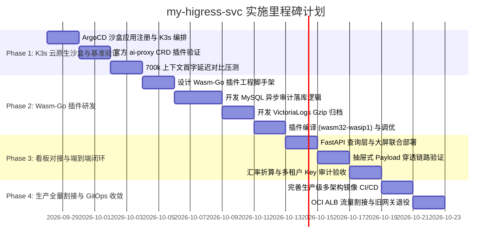

# my-higress-svc 交付目标与实施里程碑 (Delivery Goals & Milestones)

> **项目代号**：Project Phoenix-Gateway · **编制人**：Cindy (主人贴身大秘❤️)  
> **战略定位**：构建高并发、微秒级延迟、兼具完整 FinOps 财务审计与大屏能力的云原生 AI 接入平台

---

## 1. 总体交付目标与 KPI

1. **核心性能达成**：
   - 面对 **700k+ Tokens** 的超大规模 Prompt，网关层代理耗时从原有的秒级等待压降至 **< 20ms**；
   - 网关自身常驻内存控制在 **100MB 以内**（杜绝因大报文缓存导致的 OOM 风险）；
   - 彻底消灭因 Python 事件循环单线程遍历引发的 `Vertex_ai_betaException - Connection closed` 假死。
2. **业务资产 100% 继承**：
   - 现有 **MySQL HeatWave (`llm_request_logs`)** 审计记录完整无缝写入；
   - 现有 **StarFive VictoriaLogs** 报文冷归档格式与流水线完全一致；
   - 现有 **React 18 可观测看板与抽屉透视能力** 零改动平滑复活。
3. **架构极简化与高可用**：
   - 减少公网到上游之间的网络跳数，统一由 Higress 承载协议转换、路由编排与熔断降级。

---

## 2. 分阶段实施里程碑 (Milestones Roadmap)



---

### 🏁 里程碑 1：K3s 云原生沙盒搭建与极限性能验证 (Phase 1: K3s Cloud-Native Sandbox on oci-free-arm-vm)
- **目标**：彻底摒弃本地 docker-compose 中间层，与现有 `litellm-svc` 保持完全一致的交付标准，采用**方案 A（基于官方 Helm Chart 的 ArgoCD 一键全托管）**，直接在 OCI ARM 旗舰节点 `free-arm-vm` 上注册部署 Higress K3s 独立沙盒，由 ArgoCD 自动管理 CRD 与 Controller，直连现有内网与上游，验证超长上下文处理能力。
- **具体交付项**：
  1. `deploy/k8s/values.yaml`：定制化 Helm Values 配置（ARM64 调度、资源配额与日志等级）；
  2. `deploy/k8s/argocd-app.yaml`：在主人的 `my-argocd-manifests` 注册沙盒 App；
  3. `ai-proxy.yaml` / `hermes-passthrough.yaml`：根目录维护模型转译与官方内置 `ai-proxy` CRD 配置；
  4. `benchmark/test_long_context.py`：针对 100k、350k、700k 上下文进行基准测试；
- **验收标准**：
  - [ ] ArgoCD 显示 `Synced / Healthy`，Higress Pod 成功在 `free-arm-vm` (ARM64) 稳定就绪；
  - [ ] 成功使用 curl 通过 K3s Ingress/NodePort 调用 Gemini 3.8 Flash 获得有效流式输出；
  - [ ] 700k 上下文首字延迟（TTFT）代理损耗小于 5ms，容器内存稳定在 80MB 以内。

---

### 🏁 里程碑 2：自研 Wasm-Go 审计与冷归档插件研发 (Phase 2: Custom Wasm Extension)
- **目标**：由 Cindy 负责编写符合 Higress 规范的 Go 语言 Wasm 插件，复刻现有审计与冷存储核心功能。
- **具体交付项**：
  1. `plugins/finops-audit/`：基于 `github.com/alibaba/higress/plugins/wasm-go` 编写的插件源码；
  2. 异步 Token 统计与中国银行实时汇率折算算法；
  3. 基于 `wrapper.HttpClient` 异步将 Gzip 压缩后的报文发送给 VictoriaLogs；
  4. 异步将审计明细写入 MySQL HeatWave `llm_request_logs` 表；
  5. 嵌入式 Base64 正则自动截断折叠能力。
- **验收标准**：
  - [ ] 运行 `tinygo build -o plugin.wasm` 顺利生成跨平台 WebAssembly 二进制；
  - [ ] Wasm 插件在数据流回传完毕瞬间触发异步处理，主请求链路无任何卡顿。

---

### 🏁 里程碑 3：看板代码完整迁移与端到端闭环验证 (Phase 3: Dashboard Code Migration & Unification)
- **目标**：将原项目的 React 18 前端工程与后端数据查询/透视 API 代码**完整迁移至当前仓库**，实现完全独立的自包含看板交付。
- **具体交付项**：
  1. `frontend/`：将原项目的 Vite + React 18 + Tailwind CSS 源码完整迁入，保留所有图表、Token 统计与抽屉交互组件；
  2. `app/` 或 `services/dashboard-api/`：将提供 `/api/v1/logs`、`/api/v1/metrics/summary` 及 `/api/v1/logs/{request_id}/payload` 的查询模块与 SQLAlchemy/VictoriaLogs 交互逻辑完整迁入；
  3. `Dockerfile` 多阶段构建集成：前端在 Stage 1 编译生成静态包，Stage 2 统一装配；
  4. 验证前端点击调用列表时，能够通过 MySQL 字段正确定位并拉取 VictoriaLogs 的归档报文；
  5. 验证多模型 Fallback（如 Gemini 3.8 直连失败时无缝切换到 `gemini-3.8-backup` 中转渠道）。
- **验收标准**：
  - [ ] 看板代码在 `my-higress-svc` 内部直接自闭环编译打包，无需依赖原 `my-litellm-service` 代码库；
  - [ ] 主人能在浏览器中顺畅打开可观测大屏，实时刷新出通过 Higress 产生的调用流水；
  - [ ] 抽屉式报文透视（Payload Drawer）能秒级解压并高亮展示 Prompt 和 Response。

---

### 🏁 里程碑 4：K3s 集群上云与 ArgoCD GitOps 交付 (Phase 4: Production GitOps on oci-free-arm-vm)
- **目标**：将完整系统打包装入主人的基础设施仓库 `my-argocd-manifests`，**严格部署于主人的甲骨文云新加坡机房 4C24G ARM 旗舰节点 `free-arm-vm`**，通过 GitOps 实现生产环境自动化部署。
- **具体交付项**：
  1. `Dockerfile` 与 GitHub Actions CI 流水线：原生交叉编译产出 **`linux/arm64`** 多架构镜像；
  2. Kubernetes 生产资源清单元数据：
     - `Deployment`：硬性绑定节点调度 `nodeSelector: kubernetes.io/hostname: free-arm-vm`，锁定在 24GB 大内存机器上；
     - `Service` & `WasmPlugin`：加载编译完成的 Wasm 插件并暴露服务；
     - `Gateway API` / `HTTPRoute`：与现有 OCI ALB（`161.118.240.179:80`）实现同内网极速对接入站；
  3. ArgoCD Application 注册声明：`argocd-apps/higress-app.yaml`；
  4. 流量灰度切换手册（逐步把 OpenCode、Yui、Rin 的 `baseURL` 切换至新入口）。
- **验收标准**：
  - [ ] 容器成功调度并常驻运行于 `free-arm-vm` 节点，ARM64 原生架构无任何兼容性损耗；
  - [ ] ArgoCD 显示 `Synced / Healthy`，生产集群稳定常驻运行；
  - [ ] 线上全面替代完成，老旧 LiteLLM 容器安全退役。

---

## 3. 核心交付产物清单 (Deliverables Summary)

```text
my-higress-svc/
├── README.md                   # 项目全局工程架构与快速起步指南
├── ai-proxy.yaml               # 核心大模型映射、Google 直连与 Fallback 规则 (WasmPlugin)
├── hermes-passthrough.yaml     # 本地自主 Agent (Yui/Rin) 裸流无损直通路由
├── Dockerfile                  # 容器多阶段构建流水线
├── Makefile                    # 插件编译、打包与本地压测快捷指令
├── docs/
│   ├── REQUIREMENTS.md         # 详细需求规格说明书 (100% 对齐业务)
│   ├── DELIVERY_GOALS.md       # 本交付目标与里程碑计划
│   ├── ARCHITECTURE.md         # Higress 与 Envoy Wasm 核心原理设计图
│   ├── COMPATIBILITY.md        # 资产兼容契约手册 (MySQL DDL / VictoriaLogs 协议)
│   └── DEPLOYMENT_GUIDE.md     # 生产环境全链路部署与实施实操指南
├── plugins/
│   └── finops-audit/           # 自研 Wasm-Go 财务审计与冷归档插件
│       ├── main.go             # 插件入口与 Higress 生命周期钩子
│       ├── mysql_sink.go       # 异步 MySQL 入库逻辑
│       ├── vlogs_sink.go       # 异步 VictoriaLogs 报文推送与压缩
│       └── go.mod              # Go 依赖描述文件
├── deploy/
│   └── k8s/                    # 云原生生产交付图纸 (方案 A: Helm + ArgoCD)
│       ├── values.yaml         # 定制化 Helm Values (ARM64 调度与网关参数)
│       └── wasm-plugin.yaml    # WasmPlugin CRD 挂载描述
└── frontend/                   # 移植保留的 React 18 可观测大屏工程
```
